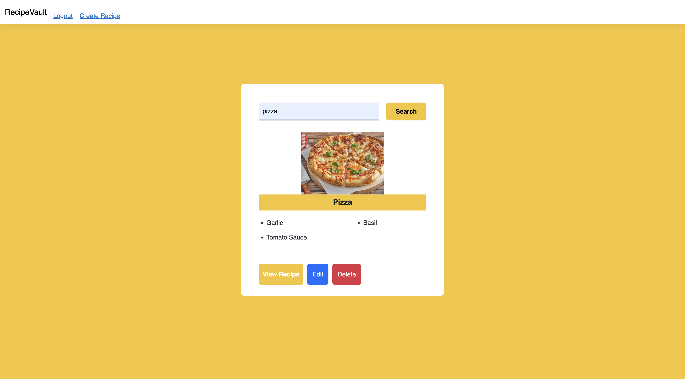

# Документация на проекта **RecipeVault**

_Версия 1.0 — юни 2025 г._

## Съдържание

1. Описание на проекта

2. Ръководство на потребителя

3. Описание на базата данни

4. Външни компоненти и зависимости


---

### 1. Описание на проекта

**RecipeVault** е ASP .NET Core MVC приложение, което позволява на потребителите да разглеждат, създават и управляват кулинарни рецепти онлайн.

**Основни функционалности**

- Публично разглеждане на всички рецепти без необходимост от регистрация.

- Регистрация и вход чрез **ASP.NET Identity**.

- Създаване, редактиране и изтриване на рецепти от техния автор.

- Качване на снимка към всяка рецепта чрез **Cloudinary**.

- REST/JSON endpoint `GET /Recipe/api/{name}` за интеграции.

- Административен панел, реализиран с **EasyData**, достъпен само за потребители в роля **Admin**.


---

### 2. Ръководство на потребителя

#### 2.1 Регистрация и вход

1. Натиснете **Register** в навигационното меню.

2. Попълнете e‑mail и парола, след което изберете **Create account**.

3. Системата автоматично Ви вписва и Ви пренасочва към началната страница.


#### 2.2 Разглеждане на рецепти

- Гост‑потребителите виждат списък с всички рецепти.

- Потърсете дадена рецепта, за да видите детайли: снимка, съставки, инструкции, автор.


- Натиснете **View recipe** за да видите детайлите на рецептата.
  


#### 2.3 Създаване на рецепта (само вписани потребители)

1. Натиснете **Add recipe**.

2. Попълнете формата: име, трудност (Easy / Medium / Hard), време, инструкции, списък със съставки и качете снимка.

3. Натиснете **Create**.


#### 2.4 Редактиране и изтриване

- В детайли на собствена рецепта изберете **Edit** или **Delete**.


#### 2.5 Административен панел

- Впишете се с акаунт в роля _Admin_.

- Отворете `/easyadmin`. Ще се зареди визуален CRUD за всички таблици (Recipes, Ingredients, Users и др.).
  
  

---

### 3. Описание на базата данни

|Таблица|Полета|Връзки|
|---|---|---|
|**Recipes**|`Id` (PK), `Name`, `Difficulty`, `Instructions`, `PreparationTime`, `ImageUrl`, `UserId` (FK)|N:1 към **AspNetUsers**|
|**Ingredients**|`Id` (PK), `Name`|M:N чрез **RecipeIngredients**|
|**RecipeIngredients**|`RecipeId` (PK, FK), `IngredientId` (PK, FK)|N:1 към Recipes; N:1 към Ingredients|
|**AspNetUsers**|стандартни полета|1:N към Recipes|

_Моделирани с_ **_Entity Framework Core_** _чрез класовете_ `_Recipe_`_,_ `_Ingredient_`_,_ `_RecipeIngredient_`_._

- Ключ `RecipeId + IngredientId` осигурява уникалност на двойките рецепта‑съставка.

- Диаграмата на връзките (ERD) е показана долу (генерирайте я с EF Power Tools или подобен инструмент).

---

### 4. Външни компоненти и зависимости

|   |   |   |
|---|---|---|
|Пакет / услуга|Версия|Роля в проекта|
|**CloudinaryDotNet**|^2.x|Хостване на изображения; клас `CloudinaryService` качва файловете във папка _recipevault_.|
|**EasyData**|^3.x|Генерира административен REST + UI слой; защитен с политика _AdminOnly_.|
|**ASP.NET Identity**|вградено|Управление на потребители, роли и автентикация.|
|**Entity Framework Core**|^8.x|ORM за достъп до базата данни.|
|**DotNetEnv**|^3.x|Зареждане на конфигурация от _.env_ (DB_CONNECTION, Cloudinary креденциали).|

#### Настройка на средата

```
# .env пример
DB_CONNECTION=Server=...;Database=RecipeVault;Trusted_Connection=False;User Id=sa;Password=yourStrong(!)Password
CLOUDINARY_CLOUD_NAME=demo
CLOUDINARY_API_KEY=...
CLOUDINARY_API_SECRET=...
```

1. Изпълнете `dotnet ef database update` за създаване на схемата.

2. Стартирайте приложението с `dotnet run`.


---
